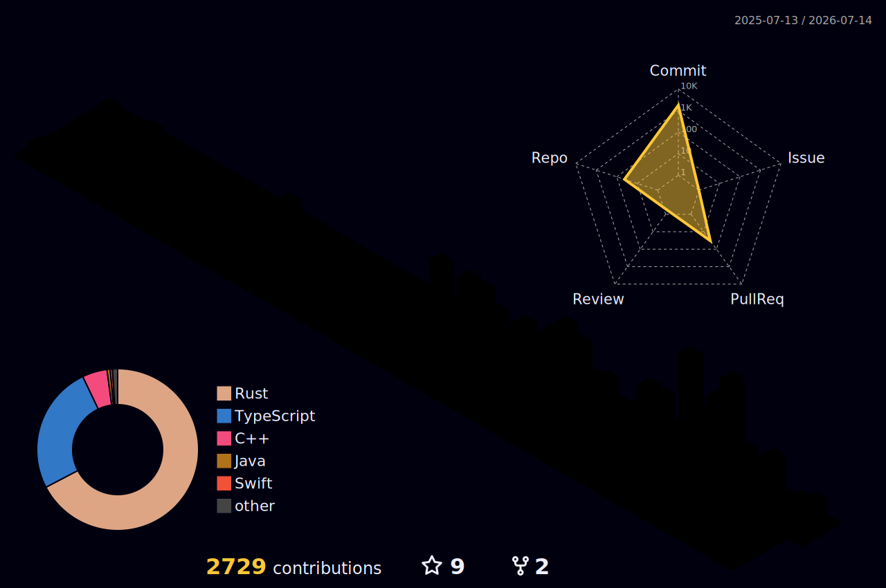

<!-- ⚡ custom hand-built animated SVG — synthwave hero -->

  

  

 

<!-- 💻 live terminal (animated SVG, no JS needed) -->

  

 

## 🐍 Contribution graph, but it's alive

  <picture>
    <source media="(prefers-color-scheme: dark)" srcset="https://raw.githubusercontent.com/eunhhu/eunhhu/output/github-snake-dark.svg" />
    <source media="(prefers-color-scheme: light)" srcset="https://raw.githubusercontent.com/eunhhu/eunhhu/output/github-snake.svg" />
    
  </picture>

## 🏙️ Contribution graph, but it's a city

  

## 📊 Numbers

  
  
   
  
    
  
   
  
   
  
  
  

## 🚀 Featured

  
  
   
  
  

| Project | What it is |
|---|---|
| [`ardex`](https://github.com/eunhhu/ardex) | Local autonomy control plane for Codex-based coding workflows |
| [`orv`](https://github.com/eunhhu/orv) | Rust DSL/runtime experiment for agent-oriented automation |
| [`charm`](https://github.com/eunhhu/charm) | Harness agent inspired by Cascade-style coding workflows |
| [`WHAT.md`](https://github.com/eunhhu/WHAT.md) | WHAT-WHY-HOW-WHO spec standard for syncing human/AI context |

## 🧠 Principles

> - **Local-first** when possible, cloud when it earns its keep
> - Automation should **reduce surface area**, not create busywork
> - Security research belongs in **authorized, reproducible, useful tooling**
> - Good tools feel **obvious** after you use them once

<!-- 🌊 custom animated footer -->

